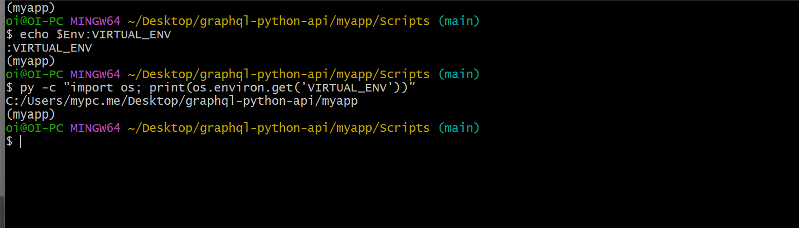

# graphql-python-api

## Step 1: Create a new python environment

### Create a new project and change the directory to the project folder

```bash
mkdir graphql-python-api
cd graphql-python-api
```
### Since it is best practice to use a virtual environment in Python, we will then create a new virtual env using the following command. Note that this step require prior installation of Python.

```python
py -m venv myapp
```
### Next, we will activate the virtual environment we have created by running the command below

```bash
source myapp/Scripts/activate.bat
```
### We can verify if our virtual environment is activated and running by running the following command
```bash
echo $Env:VIRTUAL_ENV
```
### Also, this can be verified using
```python
py -c "import os; print(os.environ.get('VIRTUAL_ENV'))"
```
### Response



### Next, we need to install the dependencies required to make our app work. These includes

#### 1. Flask — this is the web server that we are going to use.
#### 2. Flask-SQLAlchemy — an ORM that makes it easier to communicate with our SQL database.
#### 3. Ariadne — a library for GraphQL python integration.
#### 4. Flask-Cors — an extension for Cross Origin Resource Sharing.

```python
pip install flash ariadne flask-sqlalchemy flask-cors
```